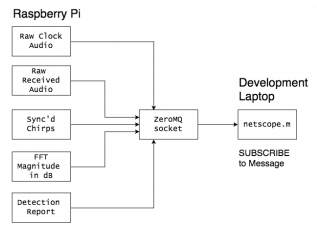

## Software-Defined Radar using Raspberry Pi and Coffee Cans
#### Project for UW EE542 - Advanced Embedded Systems Design

### Overview

#### Motivation
Dr. Gregory Charvat _et al_ developed and documented a simple, yet powerful [laptop radar system](http://ocw.mit.edu/resources/res-ll-003-build-a-small-radar-system-capable-of-sensing-range-doppler-and-synthetic-aperture-radar-imaging-january-iap-2011/projects/MITRES_LL_003IAP11_proj_in.pdf) that uses coffee cans as Receive/Transmit Antennas.

I have wanted to have an excuse for trying this out, pairing it with a Raspberry Pi, instead of a laptop, and giving it some battery power to deploy in front of my house and record all the speed-limit busters! Similar projects have been implemented and provided at least a little direction for me,

- [Doppler Radar Explanation and Demo using the coffee can radar](https://www.youtube.com/watch?v=FOWopYv-JTM&list=PL60EBFF0DDA0145CA)

This documentation will attempt to serve as a guide for duplicating and possibly extending my own effort.

#### Abstract

Doppler radar is an older technology that is finding renewed interest with modern computing hardware and software advances. It is widely used in applications like weather forecasting, law enforcement, aerospace, and healthcare. The technology exploits the Doppler effect to remotely capture data about a moving object's velocity. Additionally, system-on-a-chip technology is continually making it easier to deploy complicated embedded systems. This project will leverage the Cantenna Radar project developed by Dr. Gregory Charvat at MIT interfaced via a sound card to a Raspberry Pi to develop and deploy a simple, real-time Doppler Radar. The system will be used to measure, log, and analyze the speed of vehicles on a residential street over time.

#### Doppler Processing Playback

- Using the sample data from the [MIT opencourseware site](http://ocw.mit.edu/resources/res-ll-003-build-a-small-radar-system-capable-of-sensing-range-doppler-and-synthetic-aperture-radar-imaging-january-iap-2011/) I developed a visualization tool that demonstrates
real-time playback, peak-speed detection, and combines it with the sound file itself. I uploaded the video to youtube and it can be access by clicking the image below.

    * The upper subplot is a frequency view (transformed to speed in mph) of an average over 5 coherent integration periods, or "dwells". Each dwell is over 50 ms, and so the doppler spectrum being shown is over 250 ms, a 1/4 of a second. This seems a reasonable rate at which to track vehicle movement. Assuming, of course, the vehicle has negligible accelaration over this period.

    The red _*_ is the maximum value over the spectrum at that moment and is a reasonable estimate of the speed.

    * The lower subplot is an image of the same 250 ms period, but "seen from above". That is, the color/intensity values reflect the signal magnitude at that pixel. This image scrolls over time.

    

    * Also, the full doppler image is included as reference

#### Function Descriptions

[Doppler Speed Detector](report/doppler_speed_detector.pdf)

[Audio Scope](report/audioscope.pdf)

#### Schedule

see [Gantt Chart](report/gantt_chart.pdf)

#### Bill of Materials

see [Bill of Materials](report/bom.txt)

#### Steps

1. Setting up Raspberry Pi 2
    - Installing OS onto SD chip
        o Chose to use Arch Linux ARM
        o Followed instructions at https://archlinuxarm.org/platforms/armv7/broadcom/raspberry-pi-2
        o Challenge - initially followed instructions for Raspberry Pi 1
        o ARM architectures have less software/driver support than x_86

#### Git Basics
To clone this repository you must have a `git` client installed. This overview will assume you have installed [git for windows](https://git-scm.com/download/win) and have the `git` bash shell available. Although, the instructions will work in any UNIX-like shell environment.

-  Clone the repository by executing
`git clone https://github.com/p5a0u9l/ee542`

- This will download and place the files in a folder called `ee542`

- To add material to the repository simply move the file(s) to folder containing the repo.
- `git` will automatically see these new files.
- If, from the bash shell, inside the repo (possibly need a `cd ee542`), you enter `git status`, you will see something like

- The simplest way to push this new file to `github.com` is with
`git add -A && git commit -m "this is my message" && git push origin master`
- The output should look something like

## Report Drafting
### Introduction
This project began as a conceived innovation to the MIT Coffee Can Radar [1], hereafter referred to as the reference design. The reference design demonstrated three different radar modes - Continuous-Wave (CW) Doppler, Frequency Modulated CW, and crude Synthetica Aperture Radar (SAR) - with minor hardware adjustments and using different processing algorithms. The system was interfaced with a laptop in order to acquire a block of data and then process the data offline and show results in Matlab. A block diagram is shown for reference.

Our goal was to implement two of these modes using streaming processing and human-in-the-loop mode switching, thus demonstrating a Software-Defined Radar (SDR) system. This project could be extended to interface the control software with waveform tuning hardware and demonstrate Cognitive Radar (CR).

Our initial innovation to the reference design was to design hardware improvements and add a real-time control loop with network offloading of results. The control portion was chosen to be implemented on a Raspberry Pi 2 running Arch Linux for ARM whereas the reference design interfaced with a laptop and used offline batch-mode processing. The modified high-level design is shown below for reference.

### Discussion of Project
#### Design Procedure
The SDR design can be summarized into two components: 1. The design improvements to the reference hardware system and 2. The software design.

##### Hardware Improvements
##### Software Design
The reference design provided Matlab scripts for ingesting a block of audio data and then processing to show results. There was no detection or tracking software included in this reference and neither did we attempt to develop sophisticated detection or tracking software. Rather, the data can be transformed and displayed as an image, which then allows the eye to perform the job of a target detector/tracker system.

Initial design began with experimenting with and rewriting the reference Matlab code to handle processing the data as a stream and displaying the results in a waterfall plot. This process was repeated for each of the two radar modes - Doppler and FMCW. These Matlab prototypes then became the reference point for developing Python on the Pi.

This process naturally led to the development of two tools which became essential throughout the development - software audio oscilliscope that plugged into various source data formats. Eventually this settled into one program used to pull various results from the Pi to my macbook and display the data in real-time on the laptop. The second program is similar except that is fetches data from either the disk or the sound card and performs some processing and then displays those results in a streaming fashion.

Finally, algorithms were migrated to Python on the Linux system and development proceeded over remote shell only. During this phase, publishing results to sockets that could be read from my laptop using the tool mentioned above was critical for testing and integration.

The design procedure relied on having the reference design as a starting point, signal processing knowledge, an understanding of the mathematics and physics involved, and the ability to iterate in rapid-prototyping environments like Matlab and Python until results agreed with expectations. We feel that this approach is suitable for research projects intending to demonstrate capability. While it is acknowledged that a formal top-down methodology ensures success in a production environment, working in research and development, I have seen that creativity and persistence produce demonstration results quicker and cheaper than the process-oriented nature of production.

#### System Description
##### Specification of the public interface
###### Inputs → Lincoln
###### Outputs → Paul
The Raspberry Pi does have the capability of running a desktop environment with graphics in order to display results, yet the overhead is significant and so the decision was made leave the Pi running in a headless manner and offload the resulting data over a local network to the development laptop for display. For test and debugging purposes, it was desirable to have the ability to visualize the data as it progressed throught the processing chain. The system output interface is visualized below.

As seen, the program `netscope.m` takes a message name string for which a ZeroMQ socket is created which subscribes to that message type. The PUBLISH/SUBSCRIBE topology enables the Pi to artifically put all the data on the wire, yet only transfer the data that is requested. Matlab does not actually have a ZeroMQ implementation, yet it does expose a Python interface, through which ZeroMQ can be reached seamlessly.

In addition to the above the system also prints out status messages to the Raspberry Pi console.

Were the system to progress into a more productized instantiation, offloading reports could be achieved over a ZigBee link.

##### Algorithm Descriptions
###### Doppler CW
A Doppler CW system is able to measure the instantaneous radial velocity of a moving object. When an electromagnetic wave reflects off of a moving object, say a car, the wave is shifted in frequency by an amount proportional to the wavelength of the RF signal and the projection of the car's velocity onto the line from whence the wave originated. Doppler CW systems use a continuous sinusoid shifted to the carrier frequency. When the received signal is mixed with the transmitted signal, the difference is output. By performing a Fourier Transform on the received data, over some period of coherency, the radar is able to measure the magnitude response of the data at various frequencies. These are then related to speed using the wavelength.

###### Frequency Modulated CW (FMCW)
In FMCW, a triangle wave is generated rather than a sinusoid. When the triangle is passed through a voltage-controled oscillator (VCO) the ramp produces a linear frequency modulation (LFM) known as a chirp. This enables measurement of object distance from transmitter over the period of the ramp. As with Doppler, a frequency difference is measured and related to range by the speed of light and the bandwidth of the frequency ramp. However, for FMCW the coherent period is constrained to
the period of the triangle ramp. Therefore, FMCW signals must be synchronized to the reference clock signal. This enables knowing the time the ramp was transmitted which can be differenced with the peak return in frequency for a measurement of distance.
Another difference is the dominance of stationary objects on the response spectrum. These are collectively referred to as clutter and reside at zero Hz (DC), though the energy bleeds into the nearby frequencies as well. If a radar is primarily interested in objects that move, clutter can be mitigated by taking a slow-time derivative of the data. Slow-time in that the time interval is measured in ramps instead of samples. By subtracting the previous respnse from the current response,
much of the DC energy is removed and moving objects are left in the response. This clutter-mitigation strategy is known as a two-pulse canceller.

##### Timing constraints
For a sensor of any type, the time scale is ultimately driven by the kinematics of the objects of interest in the environment. At some point a simplification must be made and a period extablished over which it is assumed that the environment is stationary. For the case of our SDR, the objects of interest are of the human-walking and car-driving variety. Each of these is slow relative to airborne jets and so our time scale has some margin compared to typical radars.

If we assume the upper bound of stationarity to be a car moving at 35 m.p.h that translates to about 1 foot in 20 milliseconds and 5 feet in 100 milliseconds. Somewhere between 20 and 100 milliseconds we can reasonably assume our sensed environment is static. Our chirp ramps are tuned to last for 20 milliseconds, and so this becomes the fundamental unit of time for processing. Additionally, we can average over 1 to 5 of these pulses to smooth the output results and still have some confidence of the scene remaining roughly stable.

The other time constraint in this case is the ability of processing resources to handle the throughput requirements. Fortunately, the relatively slow speed of the objects of interest coupled with the fact that our system does not have the power to see beyond 1 km for a 10 square-meter target, means the information of interest is contained within a very narrow region of spectrum near DC. In fact, it is within the bandwidth of human auditory sensing. This pleasant coincidence results in an abundance of analog-to-digital converters with the requisite sample rates. This also means that our incoming data rate of 48000 samples/second is manageable for modern processor chips. Ultimately, required processing throughput depends on the data rate and the Raspberry Pi can handle a few audio signal processing operations within the required time frame.

##### Error handling → Paul

##### Hardware Implementation → Lincoln

##### Software Implementation → Paul

## Code Listings
\inputminted{matlab}{netscope.m}
\inputminted{matlab}{batch_fmcw_detection.m}
\inputminted{matlab}{imagr.m}
\inputminted{matlab}{DopplerConfig.m}
\inputminted{matlab}{batch_doppler_example.m}
\inputminted{matlab}{batch_fmcw_detection.m}
\inputminted{python}{imagr.m}
