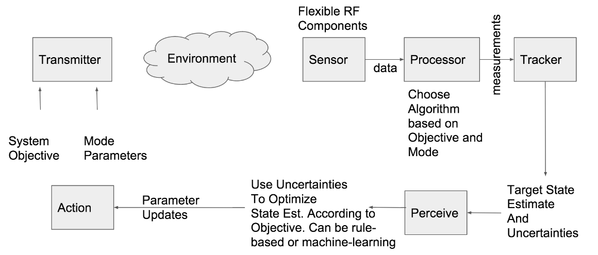

# Overview of Cognitive Radar
#### by Paul Adams and Lincoln Young

## Motivation

### Advanced Radar Catalysts

Advances in computing have seen more and more of the front-end of the radar migrated into software. Functions like pulse-compression, beam-forming, filtering, that were purely hardware implementations in the past, are now almost exclusively performed in software. Of course, software is usually easier to change, upgrade and fix than hardware implementations. Similarly, the boom in wireless communications has pushed smaller and cheaper RF components that can be leveraged in radars as well.

Every RF system that leverages computing requires an Analog-Digital Converter or Digital-Analog Converter or both. The sampling speed continues to improve and state-of-the-art systems can now sample at  about 2 GHz. The trend is pushing toward the ability to directly sample RF and do away with the traditional heterodyne receiver. The signal would go straight from an antenna/transducer, through an LNA and the ADC to the processing device, skipping the IF stage, with its mixers and filters, entirely. Of course, being able to sample up above X-band (~10 GHz) implies computing and data routing that can handle the massive bandwidth.

### Software-Defined Radar

A software-defined radar (SDR) is one where components like mixers, filters, and amplifiers are implemented on an FPGA, an embedded microchip or even a general purpose computer. A key feature of an SDR is the ability to reconfigure system operation with minimal or no hardware changes. As capability is migrated from analog to digital, increasing flexibility opens the door to radars that are capable of switching modes and/or waveforms based on scheduling or some control source - external or internal. Given an RF front-end with some flexibility in tuned frequency, polarity of elements (radiate, listen, or duplex), an antenna with a wideband response,
these changes can be dictated at the software level.

A possible use case for an SDR is now described to provide context. Suppose a radar system is deployed on an unmanned platform which is operated remotely. The system may start in an active mode, emitting pulses into the environment, at a frequency suitable to long distance surveillance, seeking to obtain a level of situational awareness. Then, possibly, an airborne warning system arrives in theater and assumes the situational awareness role. At this time, the radar system is tasked with conducting passive operations. Tuners that had been used for transmitting are now switched to receive mode and the processing algorithms are changed from active probing to passive listening. Lastly, suppose the radar is tasked with assuming an Electronic Attack role. In this case, most tuners are switched to transmit while only a few receive. The software switches to a mode that actively acquires the parameters of the radar modes being used by adversarial emitters and begins to use jamming techniques to inhibit the threat's situational awareness.

It isn't difficult to imagine the many strategic and cost advantages of rapid reconfiguriion. The majority of deployed radars, defense or otherwise, are single purpose - active surveillance, passive surveillance, fire control, weapons guidance, Electronic Attack. Each payload is an independant and expensive procurement. The reuse and modularity leveraged in software development is often
a second thought as various vendors solve the same problems in various ways. Combining multiple missions on a single, flexible, upgradeable, system reduces cost and risk.

## Cognitive Radar

With the advent of flexible, software driven radar system architectures, the ability to apply real-time adaptation is increasingly within reach. A cognitive radar closes the feedback loop and uses information pulled from the environment to adjust and improve the picture. The idea is not new, but the techonological enablers have remained far enough out of reach as to make implementation impractical. However, given the advances in the above mentioned sectioned, cognitive radar becomes more feasible.

Traditional radars have been configured in a mostly feed-forward sense, where there is no input from the controller to the radar. With some systems a radar operator may have the ability to change transmit parameters based on features seen on a display, but these are limited by response time, ability, and hardware/software limitations. Cognitive radars not only have feed-back central to their design, but are able to autonomously act upon the information and change configuration to optimize performance.

### A Day in the Life of a Signal

As seen in Figure 1, the radar transmitter is controlled by a System Objective and a set of Mode Parameters. An example of a system objective might be active surveillance - scan a given sector and track detected entities. Among the mode parameters are the waveform carrier frequency, the pulse bandwidth, the pulse repetition interval, and the pulse duration. Given these inputs, the transmitter
radiates a signal into the environment. The signal interacts with and scatters off of entities within the illumination field-of-view. The sensor, in turn, receives a signal that is a combination of the transmit signal, environment effects, and possible interference sources. Among the environment effects are typically desired components and undesired components. The processor churns through the
data collected by the sensor, minimizes unwanted signals, maximizes desired signals, and reduces it all to a set of detections with measurements and associated uncertainties. These are then sent to a tracker to correlate and extract desired target parameters, such as position, velocity, and possibly identity. It is at this stage that conventional radar systems end. An operator may view the tracks on a display. There might be coordination or action taken based on input from the tracks.

In a cognitive radar, the target state estimate and associated covariance is passed to a Perception block which uses a model to predict which mode parameter changes would optimize the state estimate. These parameter updates are sent to control block that activates the new transmitter parameters and the loop repeats. In this way, errors in target detection are minimized and surveillance focus is easily redirected with reduced settling time.

We have discussed a use case of cognitive radar that involves optimizing a set of detection parameters for a single mode of operation. An additional level of complexity would be to incorporate the software-defined radar and switch modes dynamically based on external input or autonomously given internal conditions in the Perception block. It is this combination of parameter optimization and mode adaptivity that is incredibly demonstrated in bats using acoustic pulses.

### An Example from Nature
A well-known example from nature and the result of extensive research is that of bats using echolocation for foraging/hunting and social interaction. The various species of bats have evolved to optimize echolocation to a very efficient, effective level. The following spectrogram shows an example of a bat beginning in a search mode, transitioning to a closing phase, and ending with a mode known as "terminal buzz" as the prey is captured.

Several comments can be made from observing Figure 2. First, automatic gain control is seen in the varying amplitude that mostly decreases monotonically from left to right. In addition to avoiding overly loud reflections, reducing amplitude provides a stealth component to the hunt.

Second, while not shown here, it has been demonstrated that several species of bats will adjust the frequency of their pulse, in the range of 12 to 200 kHz, to match the size of various prey.

Third, pulse duration is shown to reduce from several milliseconds long to tens of microseconds. This is consistent with transitioning from a search phase to a kill phase. The pulses can be seen to start almost leaning left as the pulse modulates in frequency and toward the end stand straighter and straighter as the chirp rate is increased.

Last, and possibly most interesting, is the reduction in pulse repetition interval and the nod of millions of years of mammalian evolution to Heisenberg's Uncertainty Principle. It is well known that measurements in two orthogonal domains can not be simultaneously resolved arbitrarily. Radars are limited by the law and can choose high resolution in range, or high resolution in
doppler, but not both. Thus, a common categorization of radars is low-, medium-, and high-PRF systems, where PRF denotes the Pulse Repetition Frequency and defines resolution for pulsed radars.

In the spectrogram, however, we see that bats use resolution in each domain where it is most advantageous. In a search mode, range resolution is not crucial, but merely a rough distance and direction are desired. Conversely, being able to resolve doppler highly, and detect minute movements at a distance is invaluable while seeking for prey. As the bat nears its prey, distance and direction become increasingly important, and movement less so. Thus, the final phase, "terminal buzzing", sees a rapid increase in PRF as the bat closes the final distance.

## State of the Art

Dr. Kristine Bell, along with colleagues from the Ohio State University, and funding from the Air Force Research Labs in Dayton, Ohio, have built upon previous work with software-defined platforms and cognitive radar experiments, and have demonstrated parameter optimization using a Maximum a Posteriori with Penalty Function (MAP-PF) tracker. A key characteristic of MAP-PF is constraining detections to a region predicted by the tracker. This implies a guided detection scheme where there is a heavy reliance on the model assumptions.

In the experiment, a single mode was selected, that of tracking a moving object - a person in this case. Additionally, a single transmitter parameter was chosen for optimization - that of the pulse repetition frequency.
